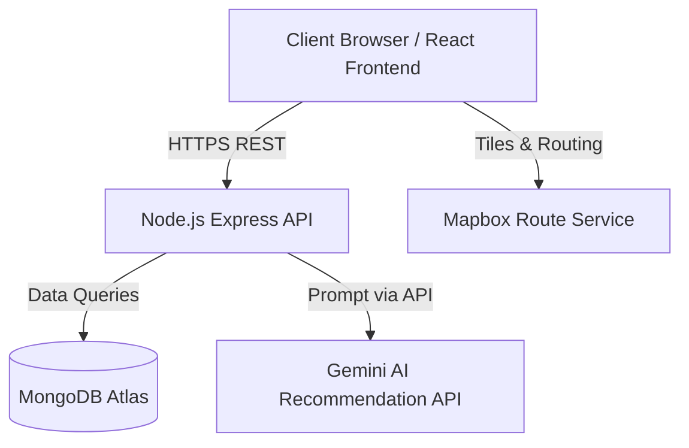

# System Architecture

## 1. High Level Architecture Diagram
The system relies on a modernized MERN stack integrating Google's Gemini for recommendations and Mapbox for visualizations.

## 2. System Layers

### 2.1 Presentation Layer
*   **Technologies**: React, TailwindCSS, Formik, Yup.
*   **Role**: Renders the UI wireframes, manages client-side routing, handles JWT storage (localStorage/cookies), and provides interactive data inputs for the AI search.
*   **Form Handling**: All forms use **Formik** for state management and **Yup** for schema-based validation. Validation runs on blur and submit, with inline error messages rendered directly below each field.
*   **Reusable Components**: Shared `FormField` (label + input + error), `LoadingButton` (submit with spinner state), and `Toast` (notification popup) components to enforce consistency and reduce duplication.
*   **Custom Hooks**: `useAuth` (login, register, logout, user state), `useApi` (generic fetch hook with loading/error tracking).
*   **API Interceptors**: Axios instance with request interceptors (auto-attach JWT from localStorage) and response interceptors (global 401 handling — clear session, redirect to login).

### 2.2 Application Layer
*   **Technologies**: Node.js, Express.
*   **Role**: Provides the RESTful APIs defining Auth, Destinations, Places, Restaurants, Property Stays, and Wishlist interactions. Acts as a secure middleman for external API calls to Gemini. Handles Role-Based Access Control (RBAC) ensuring newly registered accounts default to "user".
*   **Error Handling**: A centralized **global error-handling middleware** (`errorHandler`) is registered as the last middleware in the Express chain. A custom **`AppError`** class (extending `Error`) carries `statusCode` and `isOperational` properties. An **`asyncHandler`** higher-order function wraps every async controller, catching rejected promises and forwarding errors to the global handler. Controllers never use raw `try/catch`.
*   **Request Validation**: A reusable `validate` middleware accepts a Yup schema and validates `req.body` before the request reaches the controller, returning a standardized 400 error with field-level details on failure.

### 2.3 Data Layer
*   **Technologies**: MongoDB (Atlas).
*   **Role**: Persistent storage using relational-style ID references across multiple collections (Users, Destinations, Places, Restaurants, Stays, Wishlists).

### 2.4 AI Layer
*   **Technologies**: Gemini AI recommendation engine.
*   **Role**: Processes structured contextual prompts built dynamically by the Application sequence, returning calculated destination matching based on multi-variable inputs (budget, style, length, etc.).

### 2.5 Map Layer
*   **Technologies**: Mapbox GL JS / Mapbox APIs.
*   **Role**: Renders the interactive canvas on the Destination Detail page to plot coordinates of Stays, Places, and Restaurants.

## 3. Data Flow
1. **User Request**: User fills a Formik form (e.g., login, search) → Yup validates client-side → Axios sends HTTP request with JWT via interceptor.
2. **Backend Processing**: Express receives request → `validate` middleware checks request body → `asyncHandler` wraps controller → Controller processes logic or throws `AppError`.
3. **Data/AI Resolution**: If static data, controller queries MongoDB. If AI recommendation, controller builds prompt and queries Gemini.
4. **Response**: Success → JSON response returned to client. Failure → `errorHandler` middleware formats a standardized error response (`{ status, message, errors }`).
