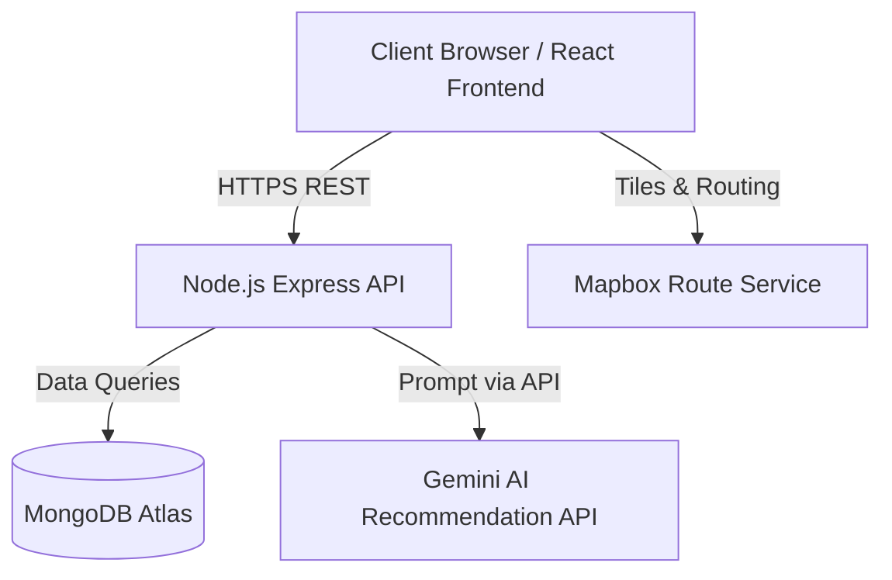

# System Architecture

## 1. High Level Architecture Diagram
The system relies on a modernized MERN stack integrating Google's Gemini for recommendations and Mapbox for visualizations.

## 2. System Layers

### 2.1 Presentation Layer
*   **Technologies**: React, TailwindCSS.
*   **Role**: Renders the UI wireframes, manages client-side routing, handles JWT storage (localStorage/cookies), and provides interactive data inputs for the AI search.

### 2.2 Application Layer
*   **Technologies**: Node.js, Express.
*   **Role**: Provides the RESTful APIs defining Auth, Destinations, Places, Restaurants, Property Stays, and Wishlist interactions. Acts as a secure middleman for external API calls to Gemini. Handles Role-Based Access Control (RBAC) ensuring newly registered accounts default to "user".

### 2.3 Data Layer
*   **Technologies**: MongoDB (Atlas).
*   **Role**: Persistent storage using relational-style ID references across multiple collections (Users, Destinations, Places, Restaurants, Stays, Wishlists).

### 2.4 AI Layer
*   **Technologies**: Gemini AI recommendation engine.
*   **Role**: Processes structured contextual prompts built dynamically by the Application sequence, returning calculated destination matching based on multi-variable inputs (budget, style, length, etc.).

### 2.5 Map Layer
*   **Technologies**: Mapbox GL JS / Mapbox APIs.
*   **Role**: Renders the interactive canvas on the Destination Detail page to plot coordinates of Stays, Places, and Restaurants.

## 3. Data Flow
1. **User Request**: User searches for a destination or clicks 'Get Recommendations'.
2. **Frontend Request**: React formats the payload and sends an HTTP request to Express.
3. **Backend Processing**: Express routes the request. If static data, it queries MongoDB. If AI recommendation, it builds a prompt and queries Gemini.
4. **Response**: Data is formed into a JSON response, returned to the UI, and rendered in TailwindCSS designed components.
