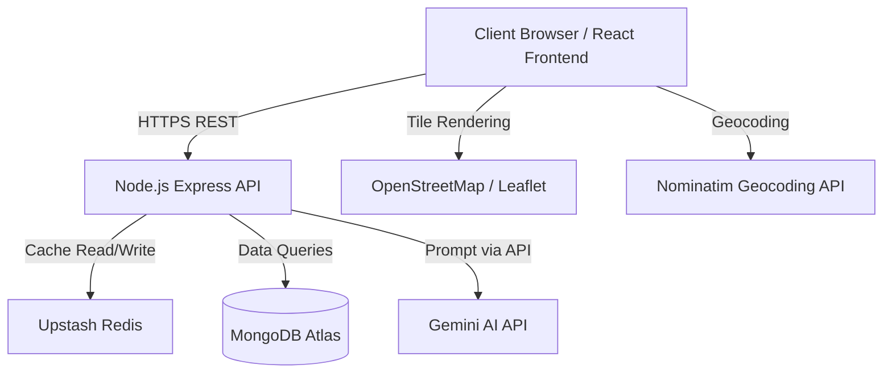

# System Architecture

## 1. High Level Architecture Diagram

## 2. System Layers

### 2.1 Presentation Layer
*   **Technologies**: React, TailwindCSS, Formik, Yup, Leaflet + OpenStreetMap.
*   **Role**: Renders UI wireframes, manages client-side routing, handles JWT (HttpOnly cookies), provides interactive data inputs for AI search.
*   **Form Handling**: All forms use **Formik** for state management and **Yup** for schema-based validation. Validation runs on blur and submit, inline errors below each field.
*   **Reusable Components**: `FormField`, `LoadingButton`, `Toast`.
*   **Custom Hooks**: `useAuth`, `useApi`.
*   **API Interceptors**: Axios with `withCredentials: true`, response interceptor for 401 → silent token refresh.

### 2.2 Application Layer
*   **Technologies**: Node.js, Express, Upstash Redis (`@upstash/redis`).
*   **Role**: RESTful APIs for Auth, Destinations, AI Recommendations, Wishlist. Acts as secure middleman for Gemini calls. Caches AI responses in Redis. Persists AI-generated destinations to MongoDB.
*   **Cache Strategy**:
    - Check `ai:search:{hash}` → check `ai:dest:{slug}` → check MongoDB → call Gemini → save to DB + cache
*   **Error Handling**: `AppError` class, `asyncHandler` wrapper, global `errorHandler` middleware, `validate` middleware.

### 2.3 Data Layer
*   **Technologies**: MongoDB Atlas.
*   **Role**: Persistent storage. Collections: Users, Destinations, Places, Restaurants, Stays, Wishlists.
*   **New fields vs original schema**:
    - `Destination`: `slug`, `aiGenerated`, `travelPlans[]`
    - `Place`: `coordinates {lat, lng}`, `dayIndex`
    - `Restaurant`: optional `placeId` ref
    - `PropertyStay`: optional `placeId` ref

### 2.4 Cache Layer (New)
*   **Technology**: Upstash Redis (serverless, free tier, REST-based — no local Redis needed).
*   **Role**: Caches AI-generated destination data to prevent repeated Gemini API calls.
*   **Keys**:
    - `ai:dest:{slug}` — full destination + plans JSON (TTL: 7 days)
    - `ai:search:{sha256-of-params}` — destination slug (TTL: 1 day)

### 2.5 AI Layer
*   **Technology**: Gemini 2.5 Flash.
*   **Role**: Two-phase prompting:
    1. Quick prompt → destination name only
    2. Full prompt → complete itinerary JSON (only when not in cache/DB)
*   **Output structure**: destination metadata + 2 travel plans + places per day + 2 budget-matched restaurants/stays per place.

### 2.6 Map Layer
*   **Technology**: Leaflet + OpenStreetMap (free, no API key required).
*   **Role**: Renders interactive map on Destination Detail page. Plots:
    - Main destination pin (indigo, large)
    - Place markers (green)
    - Restaurant markers (cyan)
    - Stay markers (purple)
*   **Geocoding**: Nominatim API for POI coordinates; fallback scatter if not found.

## 3. Data Flow

### Standard Destination Browse
1. User → Home Page → clicks Destination Card
2. React fetches `GET /destinations/:id` + sub-entities
3. Backend queries MongoDB → returns data
4. Frontend renders detail page with Leaflet map + POI markers

### AI Search Flow
1. User fills Formik form → Yup validates → Axios POST `/ai/recommend`
2. Backend hashes params → checks Redis (`ai:search:{hash}`)
3. Cache miss → quick Gemini call for destination name → normalize to slug
4. Check Redis (`ai:dest:{slug}`) → check MongoDB
5. Cache/DB miss → full Gemini prompt → parse JSON → save to MongoDB → cache in Redis
6. Return full destination + plans to frontend
7. Frontend shows 4-5 place cards on AI Search page
8. User clicks "View Itinerary" → `/ai-destination?name={slug}`
9. AI Detail page shows 2 plan tabs, each with places → restaurants + stays per place

## 4. Error Handling Strategy

### Frontend
- Yup validates all form inputs before submission
- Axios response interceptors catch 401s → silent token refresh → retry
- Toast component displays server error messages

### Backend
- `AppError` class carries `statusCode` and `isOperational` flag
- `asyncHandler` wraps all controllers — no try/catch boilerplate
- `validate` middleware rejects invalid bodies with field-level errors
- Global `errorHandler` formats all errors consistently
- Gemini parse failures throw `AppError(502)`
